```{r setup, include=FALSE}
options(htmltools.dir.version = FALSE)
knitr::opts_chunk$set(warning = FALSE, message = FALSE)
library(tidyverse) # load tidyverse package
library(babynames) # load babynames package
#library(leaflet) # uncomment to use if you install
```

# Outline of Defense

--

1. <small>The 3D genome</small>

   + <small>Topologically Associating Domains (TADs)</small>
   + <small>Hi-C sequencing</small>

--
   
2. <small>Methods for analyzing 3D structure</small>
   + <small>TAD-callers</small>
   + <small>Prediction-based methods</small>

--

3. <small>Bridging the gap between 3D HiC data and 1D ChIP-seq data for more precise domain boundary prediction</small>
   + <small>Aim 1: Develop a machine learning framework to establish an optimal TAD boundary region prediction model</small>
   + <small>Aim 2: Develop a density-based partitioning technique for precise boundary prediction at base-level resolution</small>
   + <small>Aim 3: Develop a technique for predicting boundaries on cell lines that do not have publicly available Hi-C data</small>

--

4. <small>Results</small>

--

5. <small>Conclusions</small>

--

6. <small>Deliverables</small>

--

7. <small>Future work</small>

---

class: left
background-image: url("img/3d_genome_1.png")
background-size: cover
background-position: center
background-size: contain

# 3D genome

---

class: left
background-image: url("img/3d_genome_2.png")
background-size: cover
background-position: center
background-size: contain

# 3D genome

---

class: left
background-image: url("img/3d_genome_3.png")
background-size: cover
background-position: center
background-size: contain

# 3D genome

---

class: left
background-image: url("img/3d_genome_4.png")
background-size: cover
background-position: center
background-size: contain

# 3D genome

---

# Topologically Associating Domains (TADs)

--

- <font size="5">TADs are stable and dynamic structures

   + Highly conserved across species and cell lines
   
   + Associated with gene regulation

--

- <font size="5">Disruption of the boundaries that demarcate TADs has been shown to lead to rare diseases and even cancer

   + A 60kb deletion including a TAD boundary led to overexpression of the LMB1 gene resulting in the rare disorder known as autosomal-dominant adult-onset demyelinating leukodystrophy (ADLD)

--

- <font size="5">Understanding the mechanisms through which TADs are formed remains a top priority in our goal to fully understand the functionality of the human genome

---

# Hi-C Sequencing

.pull-left[
<font size="6">
- Hi-C is a technique to capture long-range 3D genomic interactions across the whole genome
  
- A typical Hi-C experiment produces 20x the number of reads as a standard RNA-seq experiment
  
- Produces a contact matrix
]

.pull-right[
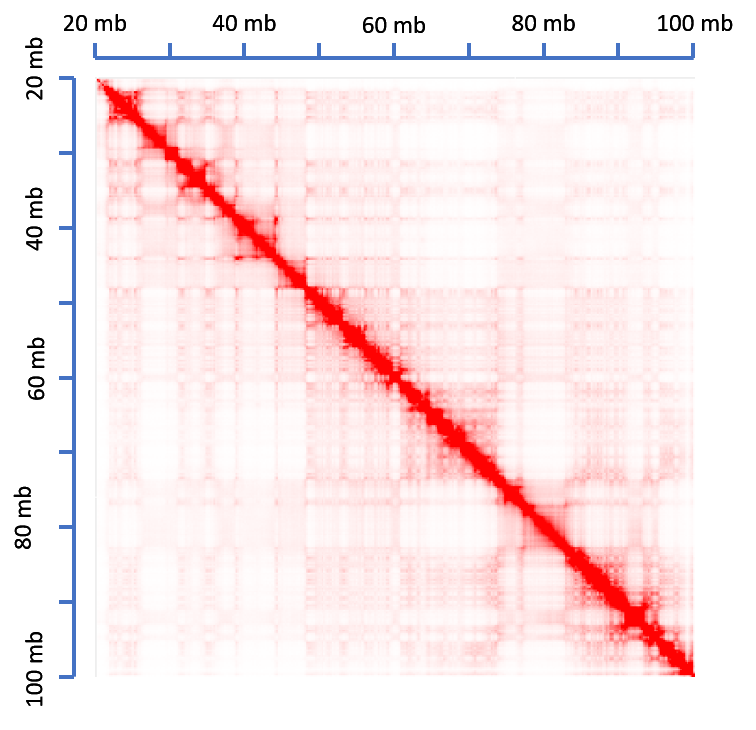
]

---

# Methods for analyzing the 3D structure

--

<font size="6"> 2 primary areas of research:

--

   1. Determining the location of boundaries that demarcate TADs using contact matrices (TAD-callers)

--

   2. Determining the full list of genomic elements that are associated with TAD formation (prediction based methods)

---

class: right
background-image: url("img/tad_caller_1.png")
background-size: cover
background-position: center
background-size: contain

# TAD-callers

---

class: right
background-image: url("img/tad_caller_2.png")
background-size: cover
background-position: center
background-size: contain

# TAD-callers

---

class: right
background-image: url("img/tad_caller_3.png")
background-size: cover
background-position: center
background-size: contain

# TAD-callers

---

# TAD-callers

<font size="5">
- Arrowhead (Rao et al.(2014))

   + How author explained why finding TAD segmentation from the contact map is tricky:

     <small>`r icon::fontawesome$solid$"quote-left"`This is due to experimental factors such as noise and inadequate coverage. It is also because of the intrinsic difficulty of the problem: the decline in contact frequency at domain edges can be subtle, and the very rapid decline in contact probability observed as one moves away from the diagonal of a contact map is a major confound for most approaches.`r icon::fontawesome$solid$"quote-right"`</small>
     
- Additional pitfall:

   + Ignore the fundamental role of functional genomic data (ChIP-seq data) in chromatin folding
   
---

# Prediction-based methods

<font size="5">
Build classifiers on ground truth TAD boundaries to draw associations with genomic elements

1. Mourad et al. (PLOS: Computational Biology; 2016)

2. Hong et al. (Nucleic Acid Research; 2017)

+ Built on Arrowhead-defined boundaries @ 10 kb/50 kb
+ Only used TFBS
+ Rudimentary feature engineering: percentage/count of overlap 
+ Regularized/unregularized multiple logistic regression 

---

# Bridging the gap between 3D HiC data and 1D ChIP-seq data for more precise domain boundary prediction

<font size="5">

--

Unanswered questions:

--

1. Can a unified framework allow us to more accurately determine the most informative genomic elements of TAD boundary formation? (Aim 1)
   
   - Feature engineering
   - Resolution 
   - Class imbalance

--

2. Can we leverage the predictive model to more precisely predict TAD boundaries at base-level resolution? (Aim 2)

--

3. Can we extend these methods to predict boundaries on cell lines that do not have Hi-C data available? (Aim 3)

---

# Aim 1: Develop a machine learning framework to establish an optimal TAD boundary region prediction model

<font size="6">

- We chose the random forest (RF) machine learning algorithm as our binary classification tool

- Ground truth TAD boundaries were identified using the ARROWHEAD pipeline at 5 kb, 10 kb, 25 kb, 50 kb, and 100 kb for 2 cell lines: GM12878 and K562

- A total of 78 cell line specific functional genomic annotations were used to build the feature space: BroadHMM, HM, and TFBS

---

# Aim 1: Develop a machine learning framework to establish an optimal TAD boundary region prediction model

Defining a resolution-specific response vector **Y** by *shifted binning*

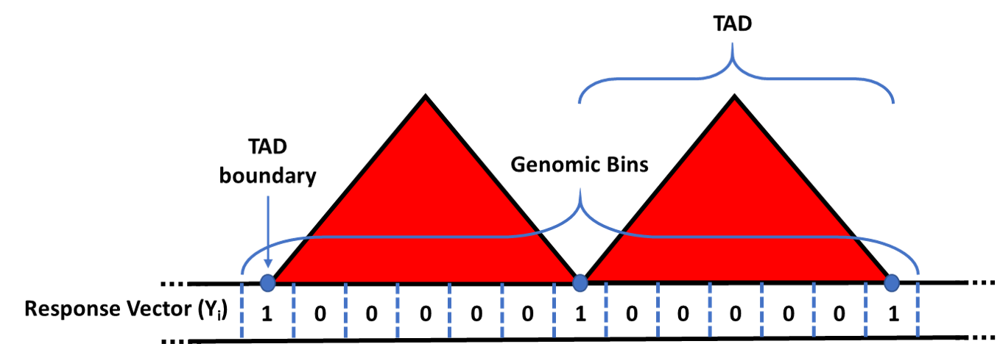

---

# Aim 1: Develop a machine learning framework to establish an optimal TAD boundary region prediction model

Defining the feature space $\textbf{X} = \{ X_1, X_2, \cdots, X_p \}$

```{r, echo=FALSE, out.width = "600px", fig.align="center"}
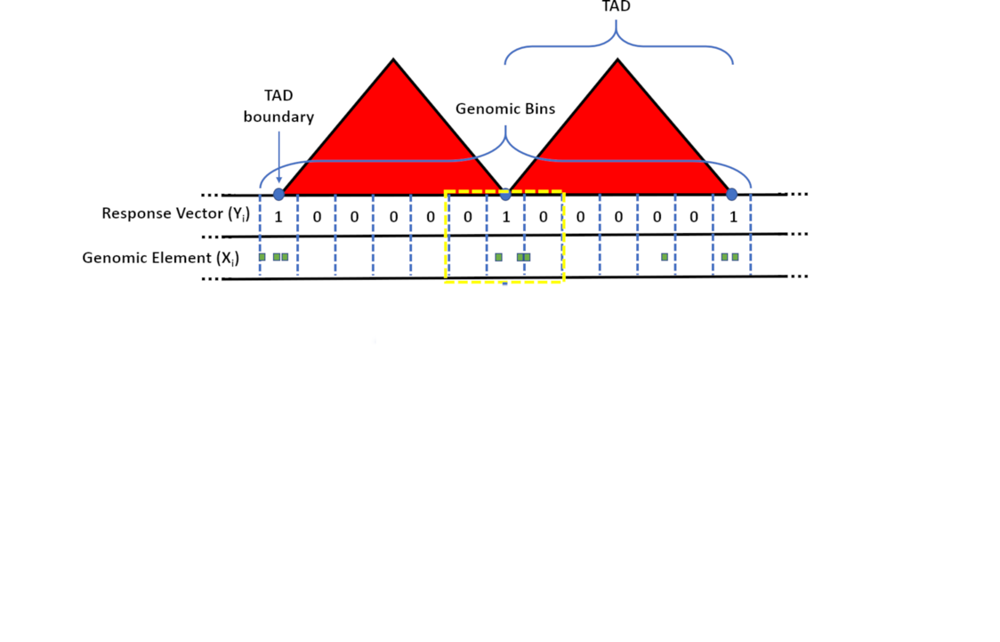
```

---

# Aim 1: Develop a machine learning framework to establish an optimal TAD boundary region prediction model

Defining the feature space $\textbf{X} = \{ X_1, X_2, \cdots, X_p \}$

```{r, echo=FALSE, out.width = "600px", fig.align="center"}
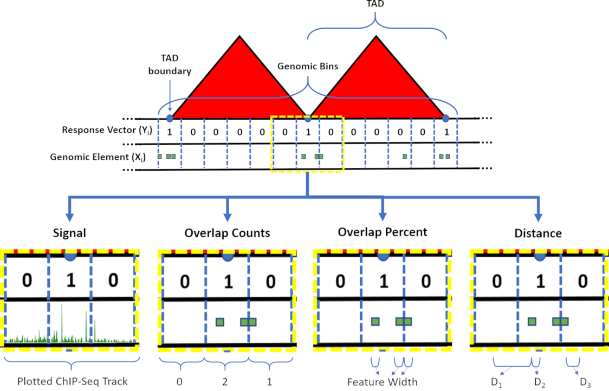
```

---

# Aim 1: Develop a machine learning framework to establish an optimal TAD boundary region prediction model

.pull-left[
<font size="5">
$L = \{ GM12878, K562 \}$

$R = \{ 5 kb, 10 kb, 25 kb, 50 kb, 100 kb \}$

$P = \{ Signal, OC, OP, Distance \}$

$S = \{ None, RUS, ROS, SMOTE \}$

$C = \{ CHR1,CHR2, \cdots \}$
]

.pull-right[
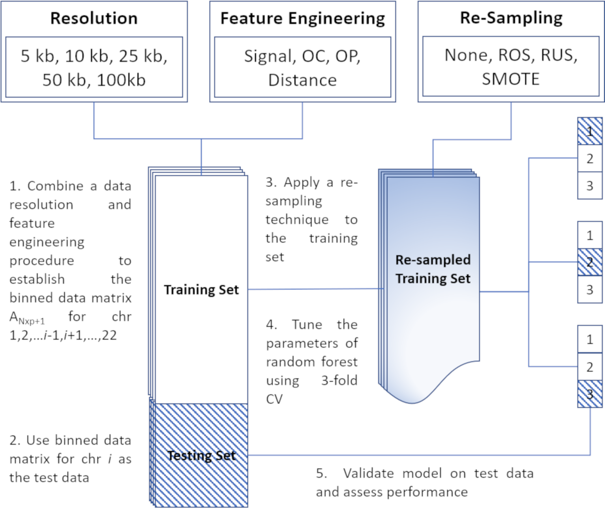
]

---

# Aim 2: Develop a density-based partitioning technique for precise boundary prediction at base-level resolution

<font size="5">
- Introducing *preciseTAD*

- What it does…

   + Leverages a predictive model in conjunction with:

      1. Density-based spatial clustering of applications with noise (DBSCAN), and 
      
      2. partitioning around mediods (PAM)
      
    to precisely predict the most biologically meaningful chromosome-specific 	TAD boundaries
    
---

# Aim 2: Develop a density-based partitioning technique for precise boundary prediction at base-level resolution

.pull-left[
<font size="6">
How it works...
]

```{r, echo=FALSE, out.width = "400px", fig.align="left"}
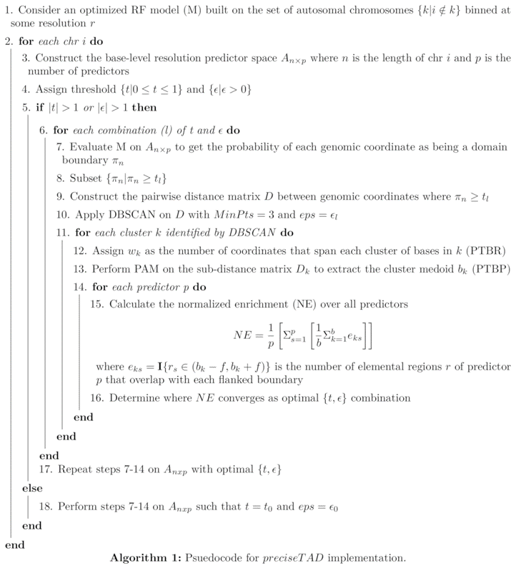
```

---

# Aim 2: Develop a density-based partitioning technique for precise boundary prediction at base-level resolution

<font size="6">
- Evaluating precision of boundary prediction

   1. Signal profile plots
   
   2. Enriched heatmaps 
   
   3. Distance to nearest ChIP-seq peak region
   
   4. Venn diagrams/Jaccard Indices
   
---

# Aim 3: Develop a technique for predicting boundaries on cell lines that do not have publicly available Hi-C data

--

- Recall the framework described in Aim 1

--

   + Now we train our RF on data from one cell line and validate it on test data from the other cell line

--

   + We compared 2 separate cases:

--

   1. Models trained on GM12878 and tested on GM12878 vs. models trained on K562 and tested on GM12878, and

--

   2. Models trained on K562 and tested on K562 vs. models trained on GM12878 and tested on K562

--

- Compare performances using AUROC from averaged sensitivities and specificities

- Implement preciseTAD using the same cross-cell line framework

- Compare boundary location for same cell line prediction vs. cross cell line prediction using Jaccard Indices

---

# Results: Aim 1

.pull-left[
<font size="6">
Optimal BA is obtained for:

   + (log2) distance-type feature space,
   
   + RUS, and
   
   + 5 kb defined genomic bins
]

.pull-right[
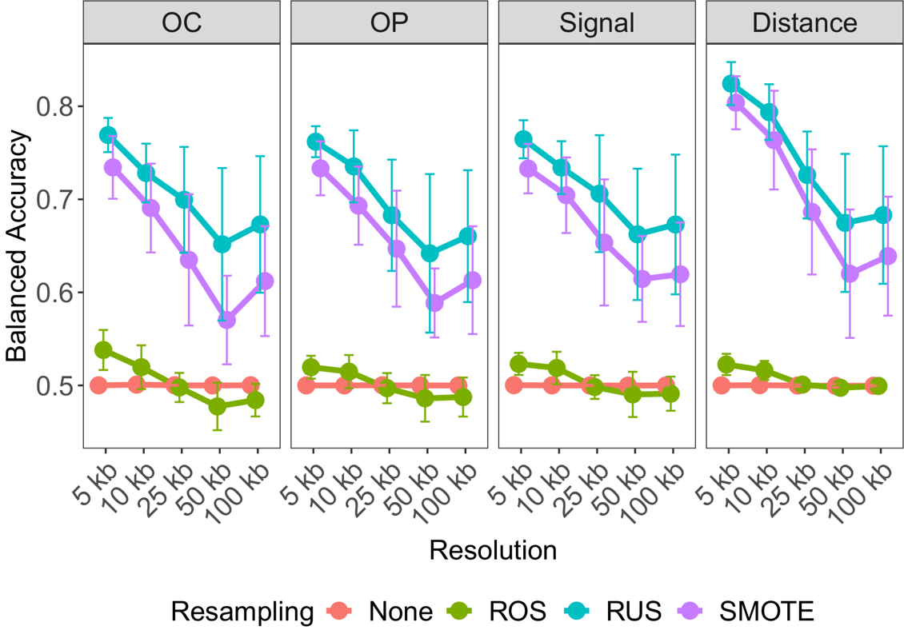
]

---

class: left
background-image: url("img/fig4_1.png")
background-size: cover
background-position: center
background-size: 87%

# Results: Aim 1

---

class: left
background-image: url("img/fig4_2.png")
background-size: cover
background-position: center
background-size: 87%

# Results: Aim 1

---

class: left
background-image: url("img/fig4_3.png")
background-size: cover
background-position: center
background-size: 87%

# Results: Aim 1

---

class: left
background-image: url("img/fig5_1.png")
background-size: cover
background-position: center
background-size: 87%

# Results: Aim 2

---

class: left
background-image: url("img/fig5_2.png")
background-size: cover
background-position: center
background-size: 87%

# Results: Aim 2

---

class: left
background-image: url("img/fig6_1.png")
background-size: cover
background-position: center
background-size: 87%

# Results: Aim 2

---

class: left
background-image: url("img/fig6_2.png")
background-size: cover
background-position: center
background-size: 87%

# Results: Aim 2

---

class: left
background-image: url("img/fig6_3.png")
background-size: cover
background-position: center
background-size: 87%

# Results: Aim 2

---

# Results: Aim 2

.pull-left[
<font size="6">
- *preciseTAD* is invariant to low resolution ground truth boundaries

- Implementing *preciseTAD* on low resolution Arrowhead results in similar boundaries across resolution
]

.pull-right[
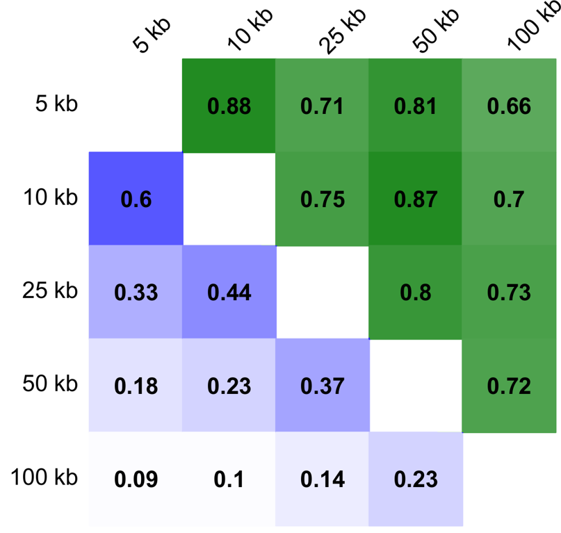
]

---

class: left
background-image: url("img/fig8_1.png")
background-size: cover
background-position: center
background-size: 87%

# Results: Aim 3

---

class: left
background-image: url("img/fig8_2.png")
background-size: cover
background-position: center
background-size: 87%

# Results: Aim 3

---

# Conclusions

<font size="5">
--

- TAD-calling & boundary prediction is a multi-faceted problem

--

- Conventional TAD-callers focus more on computational efficiency and less on precision

--

- Our framework allows us to determine the optimal list of functional genomic elements most predictive of boundary formation

--

- *preciseTAD* boundaries are:

   + More enriched for top predictive TFBS,

   + More conserved across cell lines,

   + Invariant to low resolution

--

- Our methods can accurately predict TAD boundaries on cell lines that do not have Hi-C available

---

# Deliverables

<font size="5">
--

- Models trained using Aim 1 are provided in [preciseTADhub](https://bioconductor.org/packages/devel/data/experiment/html/preciseTADhub.html) as an ExperimentHub R package accepted to Bioconductor

--

- Suite of tools discussed are provided in the [preciseTAD](https://bioconductor.org/packages/devel/data/experiment/html/preciseTAD.html) R package accepted to Bioconductor

--

- *preciseTAD* was presented as a workshop at the [EuroBioc2020](https://eurobioc2020.bioconductor.org/workshops.html) conference

--

- Our paper has been submitted to Genome Biology

preciseTAD: A machine learning framework for precise 3D domain boundary prediction at base-level resolution
Spiro C. Stilianoudakis, Mikhail G. Dozmorov
bioRxiv 2020.09.03.282186; doi: https://doi.org/10.1101/2020.09.03.282186

---

# Future Work

<font size="6">
--

- Incorporate directionality of CTCF motifs

--

- Explore the hierarchy of TADs

--

- Continue to annotate the 3D structure of other cell lines

---

# Acknowledgements 

--

Thank you to my advisor Dr. Mikhail Dozmorov 

--

Thank you to my committee members:

- Dr. Le Kang

- Dr. Roy Sabo

- Dr. David Wheeler

- Dr. Paul Brooks

- Dr. Tim York

--

Members of the Graduate Selection/Acceptance Committee

--

My RA Advisors: Dr. Caroline Carrico & Dr. Shillpa Naavaal

--

The friends I made at VCU, notably John Stansfield and Kellen Cresswell

--

Most importantly my family!

---

# Questions?

---

# Appendix

.pull-left[
- Synthetic Minority Over-Sampling Technique

- Incorporates both random under- and over-sampling

- Under-sampling is performed without replacement from the majority class
Over-sampling is performed by creating new synthetic observations using the minority class

- A synthetic example is created by first taking the difference between the minority class feature vector (data point in 2D) under consideration and its nearest neighbor, then multiplying the difference by a random number between 0 and 1, and adding it to the difference
]

.pull-right[
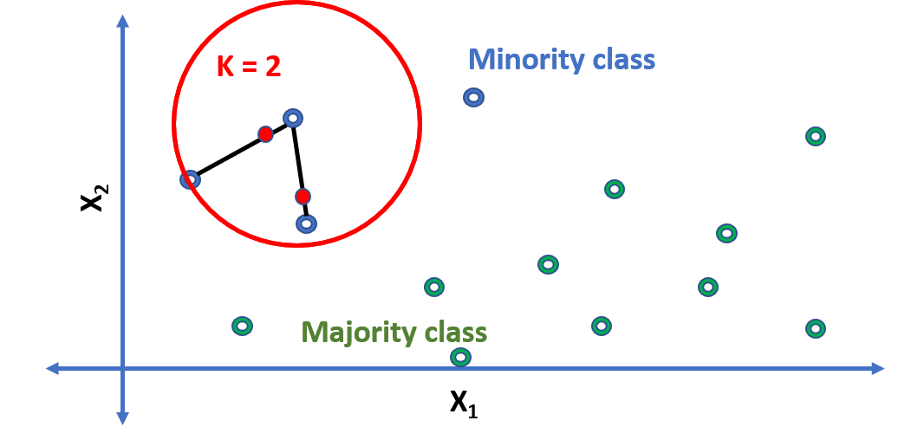
]

---

# Appendix

- For each boundary (both called and predicted), a 5000 bp flank was created on either side. 

- The flanking was broken up into 50 bp segments, for a total of 100 windows on both sides of a given boundary. 

- A coverage value was generated for each window with respect to a given ChIP-seq annotation, as the mean signal averaged by the width of the window, denoted by,

$$v_c = \dfrac{\Sigma_{j}^{m} \Sigma_{i}^{n} x_{ij}w_{ij}}{L}$$

where $x_{ij}$ is the total number of base pairs of annotation $i$ in window $j$ and $w_{ij}$ is the number of base pairs that overlap between annotation $i$ and window $j$. The denominator, $L$, is the width of the windows (here, $L$ = 50). 

- The rows of the heatmaps are ordered by enriched scores. 

- The enriched scores are calculated as the sum of coverage values weighted by the distance to the flanked boundary, denoted by

$$s_{c} = \Sigma_{d=1}^{n_1} \left( \dfrac{x_{1d} \times d}{n_1} \right) + \Sigma_{u=1}^{n_2} \left( \dfrac{x_{2u} \times (n_2 - u + 1)}{n_2} \right)$$

---

# Appendix

```{r, echo=FALSE, out.width = "600px", fig.align="center"}
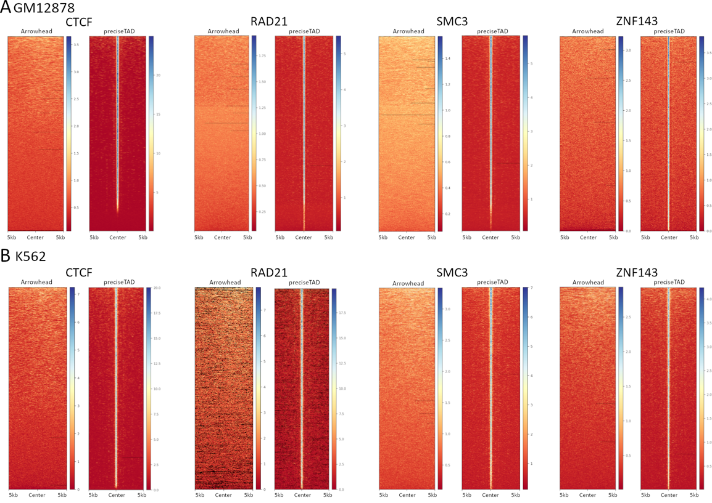
```

---

# Appendix

Jaccard Index

- The Jaccard is used as a measure of overlap between two genomic regions A and B defined as

$$J(A,B) = \dfrac{A \cap B}{A \cup B}$$

where $A \cap B$ represents the number of base pairs that overlap between $A$ and $B$, and $A \cup B$ represents the total number of base pairs between $A$ and $B$

- $A$ and $B$ represent cell line specific flanked boundaries

---

# Evaluation of *preciseTAD* parameters

```{r, echo=FALSE, out.width = "1000px", fig.align="center"}
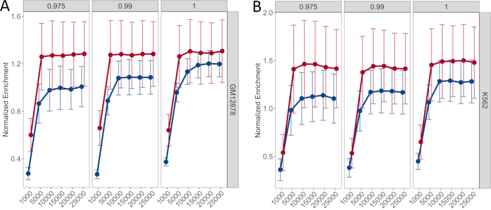
```

---

# References

1. Rao SS, Huntley MH, Durand NC, Stamenova EK, Bochkov ID, Robinson JT, Sanborn AL, Machol I, Omer AD, Lander ES, others: A 3D map of the human genome at kilobase resolution reveals principles of chromatin looping. Cell 2014, 159:1665–1680. 

2. Rosenbloom KR, Sloan CA, Malladi VS, Dreszer TR, Learned K, Kirkup VM, Wong MC, Maddren M, Fang R, Heitner SG, others: ENCODE data in the ucsc genome browser: Year 5 update. Nucleic acids research 2012, 41:D56–D63.

3. Weinreb, C., & Raphael, B. J. (2015). Identification of hierarchical chromatin domains. Bioinformatics, 32(11), 1601-1609.

4. Hansen, A. S., Cattoglio, C., Darzacq, X., & Tjian, R. (2018). Recent evidence that TADs and chromatin loops are dynamic structures. Nucleus, 9(1), 20-32.

5. Durand NC, Shamim MS, Machol I, Rao SS, Huntley MH, Lander ES, Aiden EL: Juicer provides a one-click system for analyzing loop-resolution hi-c experiments. Cell systems 2016, 3:95–98.

6. Rosenbloom KR, Sloan CA, Malladi VS, Dreszer TR, Learned K, Kirkup VM, Wong MC, Maddren M, Fang R, Heitner SG, others: ENCODE data in the ucsc genome browser: Year 5 update. Nucleic acids research 2012, 41:D56–D63.

7. Chawla NV, Bowyer KW, Hall LO, Kegelmeyer WP: SMOTE: Synthetic minority over-sampling technique. Journal of artificial intelligence research 2002, 16:321–357.

8. Lupiáñez DG, Spielmann M, Mundlos S: Breaking tads: How alterations of chromatin domains result in disease. Trends in Genetics 2016, 32:225–237.

9. Dali R, Blanchette M: A critical assessment of topologically associating domain prediction tools. Nucleic acids research 2017, 45:2994–3005.

10. Fraser J, Ferrai C, Chiariello AM, Schueler M, Rito T, Laudanno G, Barbieri M, Moore BL, Kraemer DC, Aitken S, others: Hierarchical folding and reorganization of chromosomes are linked to transcriptional changes in cellular differentiation. Molecular systems biology 2015, 11.

11. Fudenberg G, Imakaev M, Lu C, Goloborodko A, Abdennur N, Mirny LA: Formation of chromosomal domains by loop extrusion. Cell reports 2016, 15:2038–2049.

12. Boulesteix A-L, Janitza S, Kruppa J, König IR: Overview of random forest methodology and practical guidance with emphasis on computational biology and bioinformatics. Wiley Interdisciplinary Reviews: Data Mining and Knowledge Discovery 2012, 2:493–507.

13. Kuhn M: The caret package. R Foundation for Statistical Computing, Vienna, Austria. URL https://cran. r-project. org/package= caret 2012,.

14. Hahsler M, Piekenbrock M, Doran D: Dbscan: Fast density-based clustering with r. Journal of Statistical Software 2019, 25:409–416.

---

# (Un)frequently asked questions

1. Why random forest?

   + <font color="red">Invariant toward overfitting, doesn't pick out one from group of collinear predictors, interpretable measure of variable importance, flexible hyperparameters, required less computational time compared to more complicated algorithms (i.e. xgboost).</font>

2. Since random forest is an ensemble of decision trees (nonlinear), why normalize distances?

   + <font color="red">Normalization was done for computation efficiency</font>
   
3. What did you set as the other parameters in your random forest models?

   + <font color="red">ntree=500; nodesize=0.01*nrow(data)</font>
   
---

# More (un)frequently asked questions

1. Why not perform simulation study instead of relying on "ground truth" boundaries?

   + <font color="red">While there are methods for simulating Hi-C contact matrices (and therefore, TADs) and methods for simulating ChIP-seq data, they are done through separate processes. Thus, building models using both components will only capture noise</font>
   
2. Is it biased to build models using annotations and then used the enrichment of same annotations to gauge performance?

   + <font color="red">In a vacuum, yes. However, no TAD-caller is evaluated in a vacuum. They are always compared to other TAD-callers. This is because there does not exist a unified metric of performance.</font>

3. How can you be sure that you are not predicting every boundary with a CTCF, RAD21, etc. overlap?

   + <font color="red">There are hundreds of thousands of ChIP-seq peak regions throughout the genome. That would result in hundreds of thousands of predicted boundaries. We see from figures like on Slide 29 that this is not the case. Concepts like the probability threshold (t) and normalized (NE) are used to guard against this.</font>
   
4. Why DBSCAN instead of kmeans or hierarchical clustering techniques?

   + <font color="red">DBSCAN does not require preknown number of clusters, also allows for a heuristic for relating resolution to density reachable cluster points.</font>